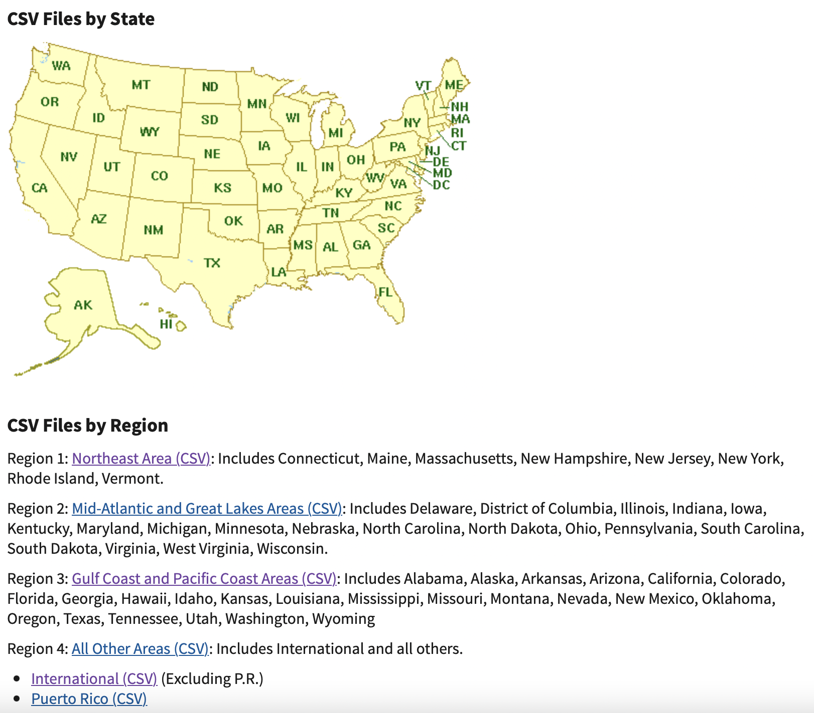

# Context of the project

The Internal Revenue Service (IRS) provides a plethora of data related to tax-exempt organizations through the publication of IRS Form 990 tax filings in XLSX format. These data sources possess filing data beginning in tax year 2012 and ending in the most recently filed and uploaded tax year of 2021. The objective is to create a database from these data and identify trends and visualize them.

# Objective

Identify trends in the financial data of tourisms offices to gain a better understanding of the financial dealings of tourisms offices across the country

# Dataset
## The data source contains three different filing formats: standard Form 990, Form 990-EZ, and Form 990-PF
Form 990 is the standard filing form for tax exempt organizations
Form 990-PF is the 990 form filed by private foundations
Form 990-EZ is filed by tax exempt organizations with gross receipts of less than $200,000 and total assets of less than $500,000 in a given tax year.

## Datased used
To simplify the analyze, the data used in this project was from the website, with years ranging from TY 2018 to TY 2021, containing only the 990-EZ forms

Scope of the study : Here, we will primerely be interested in tourisms offices, filtering of tourism offices using the EO BMF for a given year, pulling their data from the database, and subsequently using a program to convert the filing data into CSV formats

# Preprocessing steps
- creating a common schema and converting the XLSX files into Comma Separated Values (CSV) files

# Deliverable
- SQLite database containing 990-EZ filing data form from 2019-2022 and containing Exempt Organization Business Master File (EO BMF) data that was last updated on 08/08/2022
- Tourisms office’s tax information converted into CSV files
- Jupiter Notebook containing python code for the scraping, processing, database ingestion, and preliminary database analysis

# Data extraction
- The 990 filing data used for this project was sourced from IRS website containing 990 tax filing data in XLSX format, which contained data from TYs 2018-2021 for the 990-EZ forms.
- Beyond the XLSX data, there was one other key resources that needed to be extracted for this project. The other resource is the Exempt Organization Business Master File (EO BMF). The file contains information about the different groupings, overall financial data such as total asset amount and revenue amount, and locality for each organization, but does not contain actual 990 tax filing data for an organization. This file is updated each year with information on all of the tax-exempt organizations that filed a 990 form for a given tax year. 

In the context of this project, the file is used for the different grouping information under the fields Activity Code and National Taxonomy of Exempt Organization (NTEE) Code. Activity Code is a 9-digit code composed of three 3-digit numbers that correspond to different business activities. NTEE Code is a letter prefix, which relates to overall type of organization, and 2-digit number, which relates to a specific scope of organization within a type. With the activity and NTEE codes the Employer Identification Number (EIN) could be identified for every tourism office. 

# Database Creation

- The database contains tax information from all EOs (exempt organizations) and the IRS master files (EO BMFs)
The IRS website contained two different types of master files: one grouped by regions and another grouped by states 
A database table for these master files was created by performing a union operation on the two tables and removing the duplicate entries based on their unique EINs.
The 990 filings database needed to be organized into various subtables for an efficient and easy to query database design.
One such table concerns the salaries and information regarding officers working for various EOs. As the organizations have varying numbers of officers, we need to organize this information into a separate table, labeled “Officers”.
 These separate tables will be tied to the primary 990 filing data (990-EZ table) through the unique EIN possessed by each organization
 
 - 5 tables : eo_regions, eo_states, eo_combined, tax_990ez, officer_990ez.

# Database population

In order to populate the database, a Python script was necessary. I used libraries like Pandas and SQLite3 to create and populate the database. I used Pandas for parsing files and inserting the data into the tables. Pandas has many functions to parse various file formats like Excel Workbook, CSV, and JSON. Pandas also supports many different database tools, making it flexible in case the client wants to change to a different database structure in the future. Overall, Pandas and SQLite3 were optimal choices for the initial iteration of this database because they were easy to use and understand. Additionally, these libraries provided built-in tools for quickly visualizing trends in the data, such as MatPlotLib’s integration in Pandas.

## Adding the Exempt Organization Business Master Files (EO BMF)

First, the necessary packages for this program, Requests, IO, SQLite3, and Pandas, were imported. Requests were used to request master files from the IRS website. The IO library was there for test printing and to announce tasks being executed successfully. The SQLite3 library was necessary to create an SQLite database, and Pandas was used to parse the data and for data visualization.

Next, master files were downloaded and imported to the database. There are two types of master files available on IRS: the master files separated into 4 regions and the master files separated by state. They would be called Region Files and State Files, respectively. Both types were downloaded and imported to the database due to discrepancies between totals for the types.

# Key challenges with dealing with these data from TYs 2012-2021 containing the 3 forms: standard 990 forms, 990-EZ forms and 990-PF forms.
Handling with:
- variability between data tags across the annually changing tax forms.
- Changes to the regulations set by the federal government and the IRS are reflected in changes to each year’s tax form. these changes can be even more stark when comparing the XML versions of the tax forms across the years of study. Specifically, a massive transition of data tag names occurred between TY 2012 and TY 2013.

Solution: In order to create a robust and evolving databases, the variable data tags across the years of study need to be aligned into a unified schema to the greatest extent possible. This involved analyzing the tags that appear in given years, and leveraging set theory to assess intersections and differences between those tags. 
